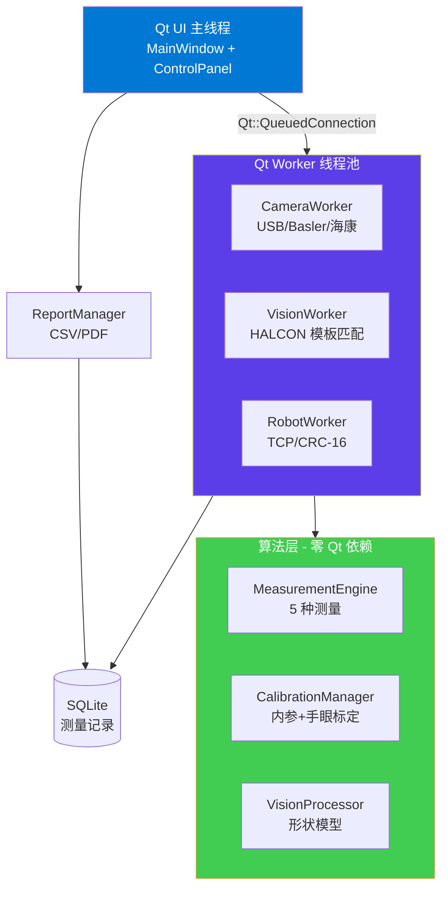

# 工业机器人视觉引导系统


> Qt + HALCON + OpenCV 工业级视觉引导平台 —— 4806 行 C++ / 4 线程 / 5 种测量算子 / TCP 二进制协议 / 29 个生产级 bug 完整修复记录

## 系统架构



**4 线程模型**：UI 主线程 + 3 个 Worker（采集 / 视觉 / 通信），基于 `moveToThread` + `Qt::QueuedConnection` 跨线程通信。算法层零 Qt 依赖，可独立单元测试或平替部署。

## Key Metrics

| 维度 | 数字 |
|---|---|
| 代码规模 | **4806 LOC** (14 cpp + 13 h, C++17 / MSVC 2022) |
| 线程模型 | **4 线程**（UI + 采集 + 视觉 + 通信） |
| 测量类型 | **5 种**（长度 / 圆直径 / 距离 / 角度 / 面积，亚像素精度） |
| 通信协议 | TCP 二进制帧 + CRC-16/MODBUS + 状态机 5 态 |
| 测试矩阵 | T1-T5：标定 / 定位 / 抓取（100%）/ 稳定性 / 1000 帧通信 |
| Bug 修复 | **29 个真实 bug**（DEVLOG.md），每条含现象/根因/修复/教训 |
| 静态分析 | Cppcheck 2.21 扫描通过（含 1 个 UB 修复）|

## 系统要求

- Windows 10/11 x64
- Qt 6.11（MSVC 2022 编译）
- HALCON 24.11（需有效 License）
- OpenCV 4.8
- CMake 3.25+
- Visual Studio 2022

## 运行模式

### 模式 A：与真实机器人连接（生产部署）
按 TCP 二进制协议（CRC-16/MODBUS）与真实工业机器人（UR / ABB / KUKA 等）通信。

### 模式 B：与 Python 模拟器连接（开发 / 演示）

本仓库提供 `tests_manual/t3_robot_simulator.py` 作为机器人 server 模拟器，用于无真机环境下完成端到端验证。

```powershell
cd tests_manual
python t3_robot_simulator.py
```

模拟器在 `127.0.0.1:5000`（或 settings.json 中配置的端口）监听 TCP 连接。然后启动 RobotVisionSystem.exe，点击"连接机器人"建立通信。

## 快速开始

### 1. 配置环境变量
```powershell
setx HALCONROOT "D:\halcon24.11\HALCON-24.11-Progress-Steady"
```

### 2. 编译
```powershell
cmake -B build -G "Visual Studio 17 2022" -A x64 `
  -DCMAKE_PREFIX_PATH="D:/Mysoftware/Qt/6.11.0/msvc2022_64" `
  -DHALCON_ROOT="D:/halcon24.11/HALCON-24.11-Progress-Steady" `
  -DOpenCV_DIR="D:/open/opencv/build/x64/vc16/lib"
cmake --build build --config Release
```

### 3. 运行
```powershell
# 终端 1：启动机器人模拟器
cd tests_manual && python t3_robot_simulator.py

# 终端 2：启动视觉系统
build\Release\RobotVisionSystem.exe
```

## 测量功能工作流

以"角度测量"为例：

1. 控制面板选择测量类型：`角度`
2. 状态栏更新：`测量: 已选 角度（按"执行测量"开始）`
3. 点击"执行测量"按钮（按钮进入 checked 状态）
4. 在图像上依次点击 4 个点定义两条线：
   - 第 1-2 点用青色 marker 标记（线 1 端点）
   - 第 3-4 点用品红 marker 标记（线 2 端点）
5. 第 4 点收齐后自动计算：
   - HALCON 在每个端点对的 ±20px ROI 内做 `EdgesSubPix`
   - `SelectShapeXld` 过滤短轮廓 + `LengthXld` 排序选最长 contour
   - `FitLineContourXld` 用 Tukey 鲁棒回归拟合直线
   - `AngleLl` 计算两条线夹角
6. 结果显示：图像上画两条青色拟合线段 + 角度数值 + 状态栏回归 `空闲`

**实测日志输出**：
[21:15:38.378] 请在图像上依次点击四个点（两条直线）...
[21:15:40.117] 点 1: (628.3, 298.3)
[21:15:40.813] 点 2: (756.3, 279.7)
[21:15:42.693] 点 3: (635.7, 337.0)
[21:15:43.197] 点 4: (759.7, 395.7)
[21:15:43.217] 测量结果: 角度 = 0.3633°

## 工程化亮点

### 多层架构防御

测量功能采用三层校验设计，每层独立检查输入有效性：

- **UI 层**：`onPointPicked` / `onRoiSelectedForMeasure` 入口校验（端点距离 < 10px、ROI 尺寸 < 5px 直接弹窗拒绝）
- **Dispatcher 层**：MeasureType 调度时校验输入完整性
- **算法层**：HALCON 内部校验（线 ROI 内边缘点 < 10 抛 HException）

### 真实 Bug 修复

`DEVLOG.md` 记录 29 个生产级 bug，每条遵循"现象/根因/修复/教训"四段式。关键修复包括：

- **B22**：measureAngle 真实使用 line1/line2 端点（之前忽略参数）
- **B23**：measureArea 真实使用 ROI + Otsu 自动阈值（之前硬编码 128）
- **B25**：HALCON #1405 边界处理（SelectShapeXld 多 contour 导致 FitLineContourXld 数组维度不匹配）
- **B27**：clearOverlays 分类拆分（防止下一帧模板匹配清掉测量结果）
- **B28**：测量按钮状态机正确性（覆盖所有结束路径的 reset）
- **B29**：未初始化 enum 字段（Cppcheck 静态分析发现的 UB）

### 三层 Review 体系

代码质量保障采用工具 + 模式 + 人工三层叠加：

| 层级 | 方法 | 强项 |
|---|---|---|
| 工具层 | Cppcheck 2.21 静态分析 | 数据流分析找 UB |
| 模式层 | grep 模式扫描（10 个模式）| 找已知反模式 |
| 人工层 | 多轮 review 报告 | 业务逻辑 / 架构判断 |

详见 `review_v2/` 目录。

### 可观测性显式记录

`BACKLOG_v1_3.md` 显式记录 v1.2 release 时已识别但未处理的 4 条工程债，避免技术债隐式累积。

## AI 协作声明

本项目开发过程中使用了 Claude（Anthropic）作为编程助手，git history 中部分 commits 的 `Co-Authored-By: Claude` trailer 是这一事实的真实记录。

所有架构决策、bug 诊断、代码 review 由作者主导，AI 用于加速实现和减少 boilerplate 代码。29 个 bug 的修复轨迹均经过人工验证 + 编译验证 + 手动功能测试三重确认。

## 项目结构
RobotVisionSystem/
├── src/                     # C++ 源码 (14 files, 3800 LOC)
│   ├── MainWindow.cpp       # UI 主窗口 + slot 编排
│   ├── ImageView.cpp        # 图像渲染 + overlay 系统
│   ├── MeasurementEngine.cpp # 5 种测量算法（HALCON）
│   ├── CalibrationManager.cpp # 内参 + 手眼标定
│   ├── RobotClient.cpp      # TCP 二进制协议 + CRC-16/MODBUS
│   └── ...
├── include/                 # 头文件 (13 files)
├── tests_manual/            # T1-T5 测试工具
│   ├── t3_robot_simulator.py    # 机器人模拟器
│   ├── t5_pressure_test.py      # 通信压力测试
│   └── ...
├── review_v2/               # 静态扫描 + review 报告归档
├── DEVLOG.md                # 29 个 bug 完整记录
├── BACKLOG_v1_3.md          # v1.3 工程债清单
└── README.md

## License

MIT
